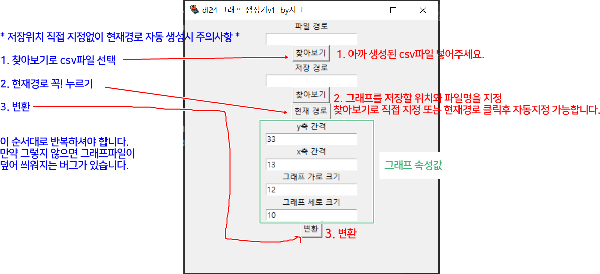

그래프를 생성하기 위해서는 다음과 같은 과정을 거쳐야 합니다.

​

​

1. 제조사에서 배포한 프로그램으로 log_xxxxxx.csv파일을 뽑고

​

​

2.  csv파일을 입력받아 그래프를 출력합니다.

​

​

​

​

​

먼저 아래 링크로 들어가 제조사에서 배포한 DL24 LOAD PC SOFT.zip를 받아주고 실행 시켜줍니다.

https://www.mediafire.com/folder/1c04afq923397/A3#ehb6a9elgztxq

​

​

dl24방전기와 연결하는법은 아래 링크에 나와있습니다.

https://www.mediafire.com/view/64lwkwdenhwpnxa/About-the-computer-online-manual.jpg

​

​

​

​

​

프로그램을 실행시키면 아래와 같은 화면이 나옵니다.

해당 프로그램에 방전기가 연결된 상태에서 방전 진행 후 프로그램을 종료하면 

​

프로그램이 존재하는 폴더에 log_xxxxxxx_xxxxxxx.csv와 같은 파일이 생성됩니다.

이제 dl24 그래프 생성기를 실행해주세요.

*파일을 바이러스로 인식해서  진행이 안되면 

설정-업데이트및 보안 -windows보안 - 바이러스및위협방지 - 바이러스및위협방지의 설정 관리 - 실시간 보호 off 해주셔야합니다

​

​

파일경로에 생성된 log_xxxxx_xxxxx.csv파일을 선택하고

​

저장경로에  저장할 위치와 파일명 지정이 가능합니다. 

만약 저장위치와 파일명을 직접 지정하기 귀찮이면 `현재경로`로 지정하는 버튼이 있습니다. 

*파일경로를 입력하지 않거나 `현재 경로`를 클릭하지 않으면 이미 존재하던 그림에 덮어 씌워집니다. 

​

지정해주시고 `변환` 클릭하면 다음과같이 그래프 파일이 생성됩니다.

그래프 속성값에서는 그래프 생성 요소 몇가지를 직접 수정 가능합니다. 

​

가로 크기와 세로 크기는 그래프 비율조정,

간격은 x,값과 y값의 갯수 수정 가능합니다.

​

아래는 속성값 수정 예시입니다. 

